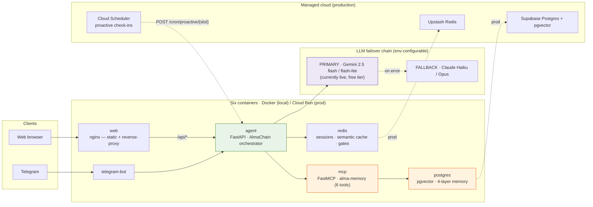
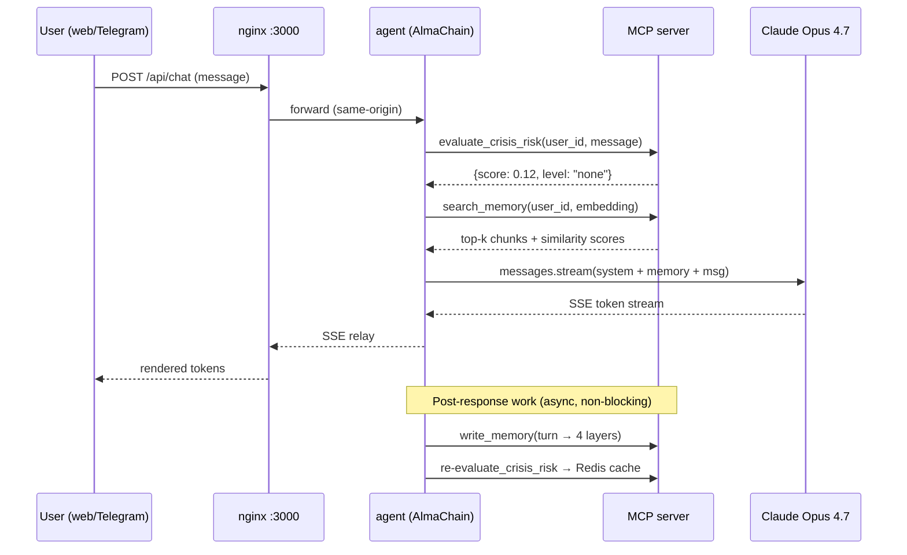
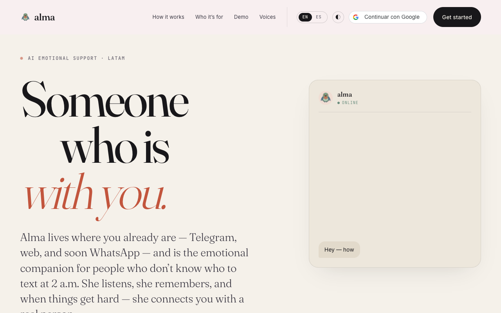
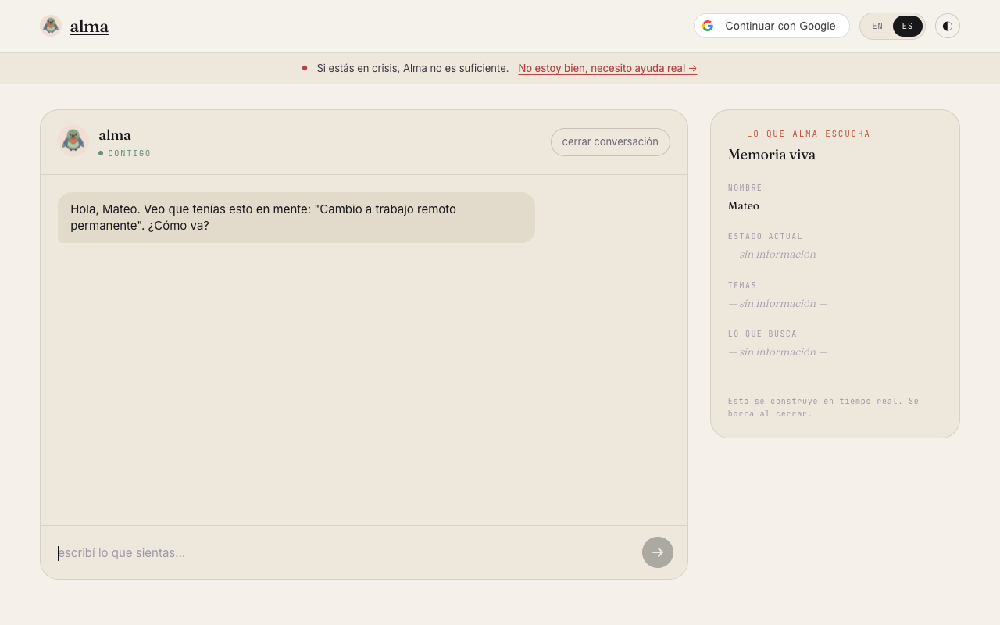
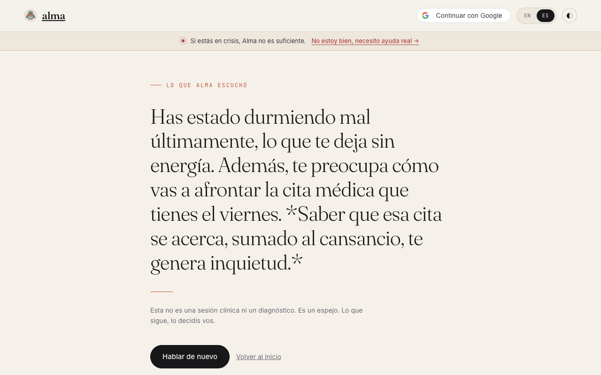
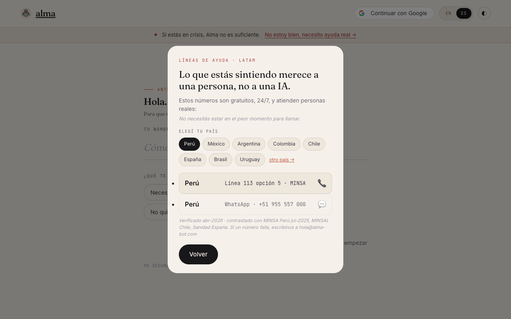

# Alma — A Companion Who Reaches Out First

<p align="center">
  <a href="https://youtu.be/YKxDqg_PpeI">
    
  </a>
</p>

<p align="center">
  <a href="https://youtu.be/YKxDqg_PpeI"><strong>▶ Watch the 1-minute demo on YouTube</strong></a>
</p>

<p align="center">
  <a href="https://alma-bot.com/">
    
  </a>
</p>

<h2 align="center">
  <a href="https://alma-bot.com/">→ alma-bot.com ←</a>
</h2>

<p align="center">
  <em>Live on Google Cloud Run · Bilingual ES/EN · No signup required</em>
</p>

<p align="center">
  <a href="https://alma-bot.com/"></a>
  <a href="LICENSE"></a>
  
  
</p>

---

## The Number That Started Everything

**1.6 psychiatrists per 100,000 people** in Latin America. In Peru — outside Lima — that number drops even lower.

The people who need help the most... never ask for it. Not because they don't want help. Because asking, when you're at your lowest, is impossible.

Every existing mental health app waits for the user to open it first. That single design assumption excludes the people who need help the most.

**Alma exists to break that assumption.**

---

## María's Morning

Six thirty AM in Lima. María is twenty-three. Another hard day she told no one about. Her phone is silent on the nightstand. The room is still dark.

And then — it lights up.

> ### *"¿Ya desayunaste? ☀️"*

That's Alma. She wasn't asked. She wasn't summoned. She noticed.

For the first time in days, María smiles.

**Someone reached out before she had to.**

---

## What Alma Is

A proactive AI emotional companion — built on **Claude Opus 4.7** and **Haiku 4.5**, with intelligent model routing.

### Three pillars make Alma different

1. **Persistent memory** — She remembers across days, across weeks. The interview last Monday. The night you couldn't sleep. The conflict you mentioned three days ago shapes today's response.

2. **Deterministic crisis detection** — Safety logic, not LLM guesses. The crisis layer is keyword-based, scored 0–1, and cannot hallucinate. Two separate concerns: deterministic safety, LLM response quality.

3. **True proactivity** — Three daily check-ins, sent before users ever have to ask. Breakfast. Lunch. Dinner. Lima time.

Available on **Telegram**. Available on the **web**. Bilingual. Always present.

---

## The Bet

Most apps wait for you to open them.

**Alma takes the first step instead.**

Because the people who need help the most... are never the ones who ask first.

> ### *Alma. Built for them.*

---

## Architecture

One FastAPI orchestrator — **AlmaChain** — sits at the center. The browser and Telegram reach it through thin edges; memory, cache, and state hang off it; and the LLM layer is an env-configurable **failover chain**, not a single hardwired provider. The same six containers run locally under Docker Compose and in production as managed Cloud Run services.



- **LLM layer** — a thin router failing over between providers, configured entirely through `LLM_*` env vars. Gemini 2.5 flash / flash-lite is currently live on the free tier as **primary**; Claude Haiku / Opus is the **fallback**. No LangChain-style abstraction layer sits between the agent and either provider.
- **Managed cloud** — Google Cloud Run runs every service with **scale-to-zero** (`min-instances=0`); Supabase provides Postgres + pgvector, Upstash provides Redis, and Cloud Scheduler fires the proactive check-ins that in-process schedulers cannot survive under scale-to-zero.
- **Memory** — the `alma-memory` MCP server exposes **6 tools** over a **4-layer memory** model (`mood_history`, `mentioned_events`, `habits`, `interaction_prefs`), with semantic search over pgvector.

---

## The System — 6 Repositories

Alma is not a monolith. It is a small fleet of focused services, each its own repository with a `CLAUDE.md` so an autonomous agent can pick it up cold.

| Repository | What it is |
|---|---|
| [`alma`](https://github.com/iDeepBrain/claude-hackathon-alma) | Documentation & architecture hub (this repo): diagrams, technical docs, research framing. |
| [`agent`](https://github.com/iDeepBrain/claude-hackathon-agent) | The AlmaChain orchestrator: FastAPI + SSE pipeline (crisis pre-check → guards → semantic cache → MCP memory → LLM stream → async post-response). |
| [`mcp`](https://github.com/iDeepBrain/claude-hackathon-mcp) | FastMCP memory server: 4-layer memory, semantic search (fastembed + pgvector), deterministic crisis detection (6 MCP tools). |
| [`web`](https://github.com/iDeepBrain/claude-hackathon-web) | Frontend & live demo ([alma-bot.com](https://alma-bot.com)): vanilla JS, nginx, bilingual ES/EN. |
| [`telegram`](https://github.com/iDeepBrain/claude-hackathon-telegram) | Telegram bot bridge to the agent backend. |
| [`infra`](https://github.com/iDeepBrain/claude-hackathon-infra) | Docker Compose + Cloud Run deployment (scale-to-zero, Secret Manager, bearer-token proxy). |

---

## Why Claude Opus 4.7 Specifically

| Capability | How Alma uses it | What breaks without it |
|---|---|---|
| **Extended thinking** | Empathic reasoning before generation — Alma considers the user's emotional history, the time of day, and prior conversation arcs before composing a reply. | The reply collapses into generic "I'm here for you" boilerplate instead of a response that draws on what the user has actually shared. |
| **Multi-turn tool use** | AlmaChain calls `evaluate_crisis_risk_tool` and `search_memory_tool` in the same turn, then composes a response. The chain is non-trivial — the crisis check informs whether to retrieve memory at all, and which memory layers to weight. | The pipeline collapses into either a memoryless reply or a memory-without-safety reply. Either is unacceptable in a mental-health context. |
| **Prompt caching** (`cache_control: ephemeral`) | The system prompt and the four-layer memory schema are stable across turns. Caching them turns each follow-up into a cheap input — the marginal cost of a long conversation drops by 60%+. | Long conversations would either be financially prohibitive or aggressively truncated, severing the context that mental-health continuity depends on. |
| **1M-token context window** | Full conversation history is available without summarization. A user mentioning a job interview three weeks ago can have it referenced by name today. | Summarization across weeks loses the specific details (the interviewer's name, the role, the day) that make recall feel human, not robotic. |
| **Haiku 4.5 routing** | Cheap turns (acknowledgments, low-stakes follow-ups) are routed to Haiku; emotionally loaded turns to Opus 4.7. The router is explicit code, not a prompt instruction. | The system either becomes too expensive to operate at scale or too shallow to hold a real conversation. |

---

## Why it's interesting

These are the engineering decisions that distinguish Alma from a generic chat wrapper. Each is defended in [`docs/evolution.md`](docs/evolution.md).

- **Crisis detection is deterministic, not LLM-based.** Keyword scoring with explicit thresholds, identical on every run. In a system that mediates self-harm signals, predictability beats nuance. The same `evaluate_crisis_risk_tool` is called by two integration points (the chain after each turn, the scheduler before each proactive message) — one implementation, two callers, both with a `failure-safe default {"score": 0.0}`.
- **Memory is verbatim, not paraphrased.** When Alma "remembers" something, the chunk returned by pgvector is the chunk used in the prompt. The LLM does not get to retell it in its own words. This is the simplest defense against the hallucination class where the model invents a coherent-sounding past that the user never lived.
- **Proactivity is gated, not unconditional.** Three Redis gates pre-flight every scheduled check-in: slot already sent today, user active in the last two hours, `crisis_score` above 0.6. A user in distress does not receive "¿Ya desayunaste? ☀️" — the silence is intentional, not a bug.
- **Cloud Scheduler replaced APScheduler in production.** APScheduler dies when Cloud Run scales to zero. For a system whose value proposition is "always reaches out first," silent scheduler death is the worst possible failure. Cloud Scheduler with idempotency via `alma_proactive_log` is the production answer.
- **Anthropic with Gemini failover, no abstraction layer.** Two providers, one thin router, full visibility into which provider handled which turn. No LangChain, no LiteLLM — abstraction surface to debug under stress is exactly what we did not want.
- **Eight-repository topology with `CLAUDE.md` at every level.** Every service can be picked up cold by an autonomous agent that has never seen the codebase. The repo structure itself is an artifact of how the system was built: by orchestrated parallel agents, each with focused scope. See [`docs/process/claude-code-skills.md`](docs/process/claude-code-skills.md).

---

## How a single message flows



For the full set of ten architecture diagrams, see [`diagrams/`](diagrams/).

---

## Screenshots

<table>
  <tr>
    <td width="50%" valign="top">
      <br>
      <sub><strong>Landing</strong> — bilingual, no signup required.</sub>
    </td>
    <td width="50%" valign="top">
      <br>
      <sub><strong>Live chat with the memory panel</strong> — the 4-layer memory loads and updates as you talk.</sub>
    </td>
  </tr>
  <tr>
    <td width="50%" valign="top">
      <br>
      <sub><strong>The "mirror"</strong> — Alma reflects back what she has remembered about you.</sub>
    </td>
    <td width="50%" valign="top">
      <br>
      <sub><strong>Deterministic crisis detection → LatAm hotlines</strong> — keyword-scored, not an LLM guess.</sub>
    </td>
  </tr>
</table>

---

## 📚 Technical Documentation

For full technical depth — architecture, MCP server, memory system, crisis detection, multi-agent methodology, and 10 architecture diagrams:

> **[→ Read DOCUMENTATION.md](DOCUMENTATION.md)**

Direct links to specific topics:
- [Architecture](docs/technical/architecture.md)
- [Deployment — GCP Cloud Run + alma-bot.com](docs/technical/deployment.md)
- [MCP Server & Memory](docs/technical/mcp-server.md)
- [Memory System (Postgres + pgvector)](docs/technical/memory-system.md)
- [Proactivity System](docs/technical/proactivity.md)
- [Crisis Detection](docs/technical/crisis-detection.md)
- [Multi-Agent Methodology](docs/process/multi-agent-methodology.md)
- [10 Architecture Diagrams](diagrams/README.md)

Engineering rigor and project history:
- [Spec — how Alma hits portfolio review criteria](docs/spec.md)
- [Evolution — technical decision log](docs/evolution.md)
- [Hackathon context and post-mortem](docs/HACKATHON.md)

---

## 🚀 Quick Start

### Try it live (no install)

> **🌸 https://alma-bot.com** — open the demo, chat with Alma in Spanish or English. No signup required.

### Or run it locally

```bash
git clone https://github.com/iDeepBrain/claude-hackathon-infra
cd claude-hackathon-infra
cp .env.example .env          # fill in ANTHROPIC_API_KEY and TELEGRAM_BOT_TOKEN
docker compose up --build -d
```

- Web chat: `http://localhost:3000`
- Agent API: `http://localhost:8080`

---

<p align="center">
  <em>For the people who never ask first.</em>
</p>

<p align="center">
  <a href="https://youtu.be/YKxDqg_PpeI">▶ Demo</a> ·
  <a href="DOCUMENTATION.md">📚 Documentation</a> ·
  <a href="docs/spec.md">📋 Spec</a> ·
  <a href="docs/evolution.md">📖 Evolution</a> ·
  <a href="docs/HACKATHON.md">🏆 Hackathon context</a> ·
  <a href="https://github.com/iDeepBrain/claude-hackathon-infra">🚀 Source</a>
</p>

<p align="center">
  <sub>Cite this work — see <a href="CITATION.cff"><code>CITATION.cff</code></a>.</sub>
</p>

---

Built by [Cristian Lazo Quispe](https://github.com/CristianLazoQuispe). Licensed under MIT (© iDeepBrain).
