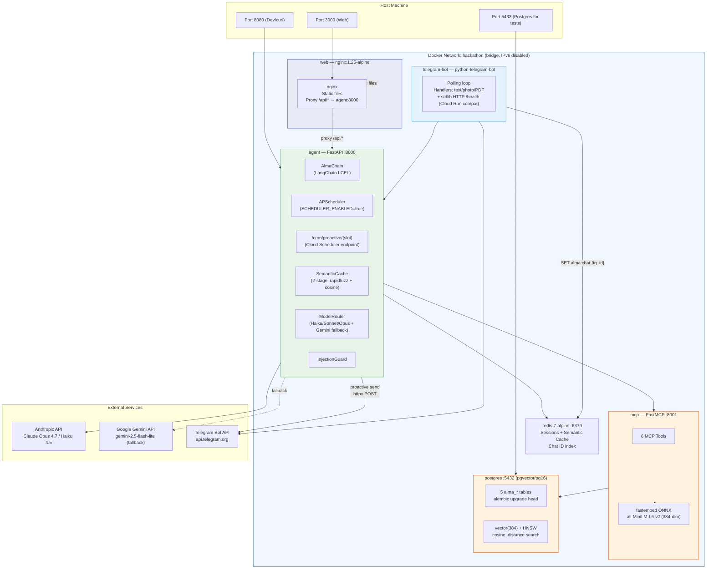

# Global System Architecture

Alma runs in two parallel environments that share the same code:

- **Local** (this diagram) — six Docker containers on a private `hackathon` bridge network. Postgres+pgvector and Redis run as containers, APScheduler runs in-process inside the agent.
- **Cloud (production)** — same services as Cloud Run instances, fronted by `alma-bot.com` (Cloud Run Domain Mapping). Postgres lives in Supabase, Redis in Upstash, and APScheduler is replaced by Cloud Scheduler firing HTTP POSTs to `/cron/proactive/{slot}`. See **[Deployment](../docs/technical/deployment.md)** for the Cloud Run topology.

External dependencies in both environments: Anthropic API (Claude — primary LLM), Google Gemini API (fallback LLM), Telegram Bot API (push messaging).



## Production at `alma-bot.com`

In Cloud Run the topology stays the same but each service runs as its own managed instance, and Postgres + Redis are external managed services:

```
Browser → DNS Cloudflare (alma-bot.com → 216.239.x.x)
       → Google Frontend (SNI alma-bot.com → SSL cert valid)
       → alma-web (Cloud Run)
            nginx /api/* proxy → alma-agent (Host header rewritten via envsubst)
       → alma-agent (Cloud Run)
            FastAPI + AlmaChain + LLM chain
       → alma-mcp (Cloud Run, public for service-to-service)
            ↓ asyncpg
            Supabase Postgres + pgvector (Session Pooler, IPv4)
       → Upstash Redis (TLS, rediss://)
       → Anthropic / Gemini APIs
       → alma-telegram-bot (Cloud Run, polls api.telegram.org)

Cloud Scheduler (3 cron jobs) → POST /cron/proactive/{slot}
                                 X-Cloud-Scheduler-Token header
                                 (verified against CRON_TOKEN secret)
```

## Key Takeaways

- **Same code, two environments**: The application is identical between local Docker and Cloud Run. Only env vars (`DATABASE_URL`, `REDIS_URL`, `MCP_URL`, `SCHEDULER_ENABLED`) change.
- **Postgres + pgvector everywhere**: Local stack mirrors prod by running `pgvector/pg16` as a container with the same `alembic upgrade head` schema. No "works on my SQLite, breaks in prod".
- **Agent is the hub**: The FastAPI agent connects to Redis, MCP, Anthropic, Gemini, and Telegram — single point through which all conversation data flows.
- **LLM dual-provider with auto-fallback**: Anthropic Claude is primary; Gemini auto-takes-over when Anthropic returns errors (e.g. credit exhausted). Configured via 8 `LLM_*` env vars without touching code.
- **APScheduler vs Cloud Scheduler**: APScheduler runs in-process locally (single replica). Cloud Scheduler fires HTTP POSTs in production where multiple agent replicas would otherwise duplicate jobs.
