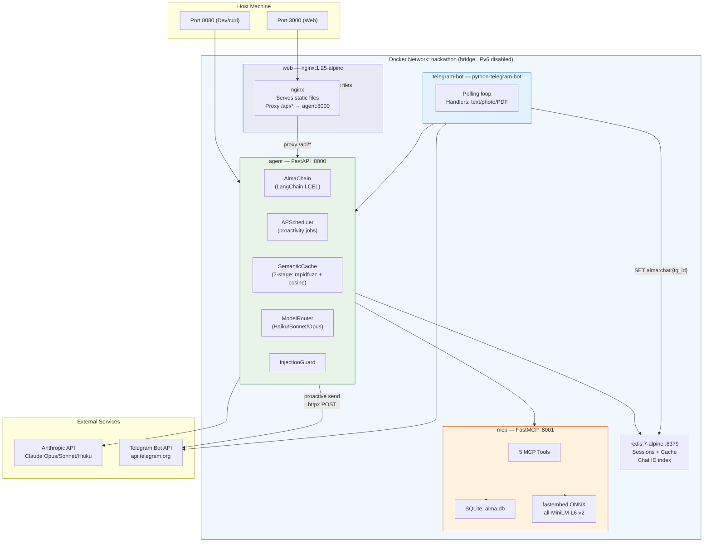

# Global System Architecture

All five Docker services run in a single Docker Compose on a private `hackathon` bridge network (IPv6 disabled). Only two ports are exposed to the host: port 3000 for the web frontend served by nginx, and port 8080 for direct developer access to the FastAPI agent. External dependencies are the Anthropic API (for Claude LLM calls) and the Telegram Bot API (for proactive messaging). Internal communication flows through Redis for sessions/cache and the MCP server for persistent semantic memory.

## Key Takeaways

- **Single Compose, minimal exposure**: All 5 services share one bridge network with only 2 host ports (3000 for users, 8080 for dev), keeping the attack surface small.
- **Agent is the hub**: The FastAPI agent is the central orchestrator — it connects to Redis, MCP, Anthropic API, and Telegram API, making it the single point through which all data flows.
- **Two external dependencies**: The system relies on exactly two external APIs (Anthropic for LLM inference, Telegram for push messaging), with everything else running locally in Docker.
