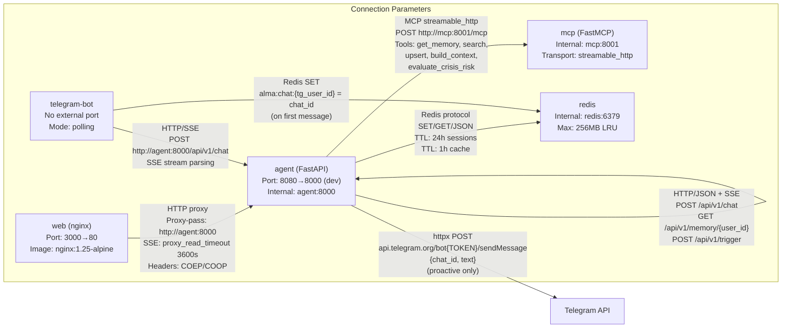

# Inter-Service Communication Map

This diagram details the protocols, ports, and specific parameters for every service-to-service connection in the Alma stack. Each arrow is annotated with the transport protocol, URL paths, key configuration values, and data formats exchanged. This serves as a quick reference for developers needing to understand how services discover and communicate with each other.

## Key Takeaways

- **Same-origin proxy eliminates CORS**: nginx proxies `/api/*` to the agent on the same origin, so the browser never triggers CORS preflight requests.
- **SSE requires special nginx config**: The proxy uses `proxy_buffering off` and a 3600s read timeout to support long-lived SSE streams without premature disconnection.
- **MCP uses streamable HTTP transport**: The agent communicates with the MCP server via `streamable_http` (not stdio), posting to `http://mcp:8001/mcp` for all 5 memory tools.
