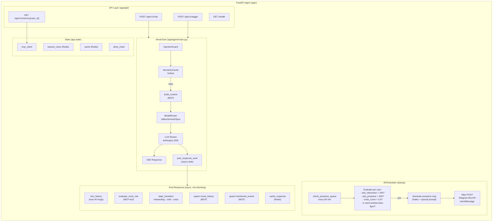

# Agent Internal Architecture

This diagram shows the internal structure of the FastAPI agent (`claude-hackathon-agent`), the core orchestration service. It breaks down the API layer (4 endpoints), the AlmaChain pipeline (guard, cache, context, routing, LLM streaming, SSE), the post-response async work (6 background tasks), the APScheduler proactivity system, and the shared application state. The agent is the most complex service in the stack and handles both reactive (user-initiated) and proactive (system-initiated) flows.

## Key Takeaways

- **Pipeline architecture**: Every message flows through a strict pipeline: InjectionGuard, SemanticCache lookup, MCP context building, model routing, LLM streaming, and SSE delivery -- ensuring consistent safety and performance.
- **Non-blocking post-response work**: After streaming the response, 6 background tasks run asynchronously (crisis evaluation, memory upserts, cache storage, history trimming) without blocking the user's SSE stream.
- **Proactivity lives in the agent**: APScheduler runs inside the same FastAPI process, evaluating users every 60 minutes against 4 safety gates before sending proactive messages via Telegram.
