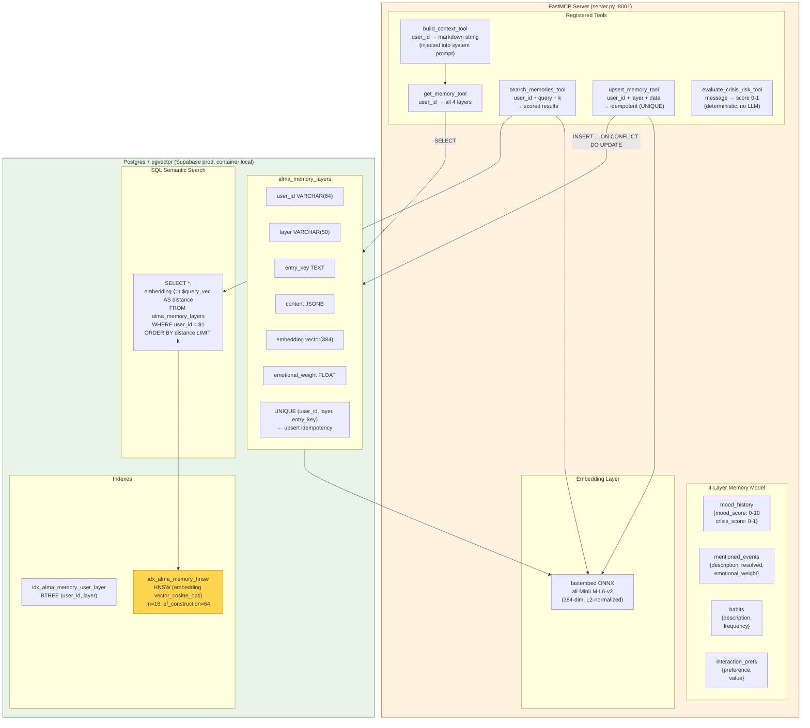

# MCP Memory System

This diagram details the internals of the FastMCP semantic memory server (`claude-hackathon-mcp`). It exposes 5 tools over streamable HTTP, stores data in a 4-layer memory model (mood_history, mentioned_events, habits, interaction_prefs) backed by **Postgres + pgvector**, and provides semantic search using fastembed ONNX embeddings (all-MiniLM-L6-v2, 384 dimensions) with an HNSW index for `O(log n)` retrieval. The `build_context_tool` composes all layers into a markdown string injected into the LLM system prompt, giving Alma persistent knowledge about each user.

> **v1 → v2 migration:** Originally backed by SQLite (`alma.db` with `BLOB` embeddings + Python in-memory cosine). Migrated to Postgres + pgvector to make the MCP stateless and Cloud-Run-friendly. See [Deployment](../docs/technical/deployment.md) for the migration story.

## Key Takeaways

- **4-layer memory model**: User memory is structured into `mood_history`, `mentioned_events`, `habits`, and `interaction_prefs` — each with its own JSON schema, enabling targeted retrieval and context building.
- **Crisis detection is deterministic**: `evaluate_crisis_risk_tool` uses keyword matching (no LLM) to produce a 0-1 score, ensuring fast, predictable, cost-free safety evaluations.
- **Semantic search via SQL HNSW**: Embeddings live in `vector(384)` columns. The HNSW index makes top-k cosine search an `O(log n)` SQL query — no Python loop, no in-memory load. Same indexed query works against the local Docker Postgres or Supabase via the Session Pooler.
- **Idempotent upserts**: A `UNIQUE (user_id, layer, entry_key)` constraint plus `INSERT ... ON CONFLICT DO UPDATE` means re-sending the same fact yields the same row (with updated content + new embedding).
