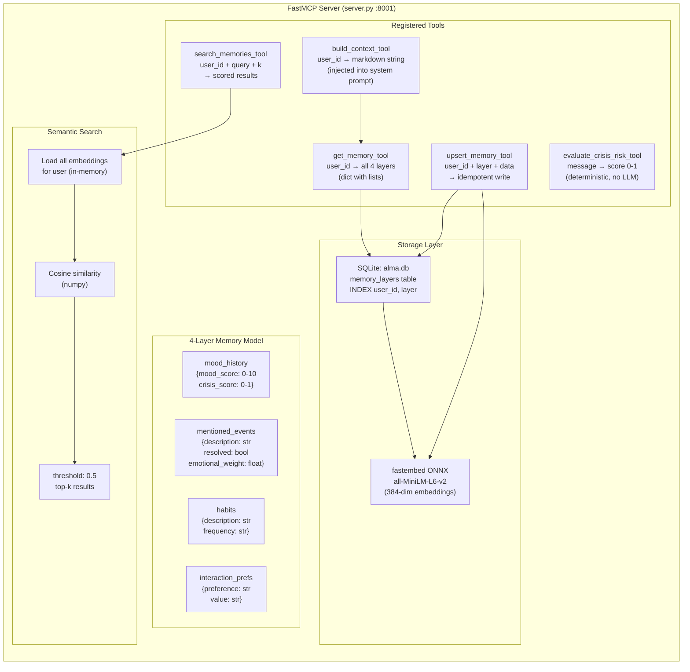

# MCP Memory System

This diagram details the internals of the FastMCP semantic memory server (`claude-hackathon-mcp`). It exposes 5 tools over streamable HTTP, stores data in a 4-layer memory model (mood_history, mentioned_events, habits, interaction_prefs) backed by SQLite, and provides semantic search using fastembed ONNX embeddings (all-MiniLM-L6-v2, 384 dimensions). The `build_context_tool` composes all layers into a markdown string injected into the LLM system prompt, giving Alma persistent knowledge about each user.

## Key Takeaways

- **4-layer memory model**: User memory is structured into mood_history, mentioned_events, habits, and interaction_prefs -- each with its own schema, enabling targeted retrieval and context building.
- **Crisis detection is deterministic**: The `evaluate_crisis_risk_tool` uses keyword matching (no LLM) to produce a 0-1 score, ensuring fast, predictable, and cost-free safety evaluations.
- **Semantic search with low overhead**: Embeddings are generated via fastembed ONNX (all-MiniLM-L6-v2) and searched in-memory with cosine similarity, avoiding the need for a vector database.
