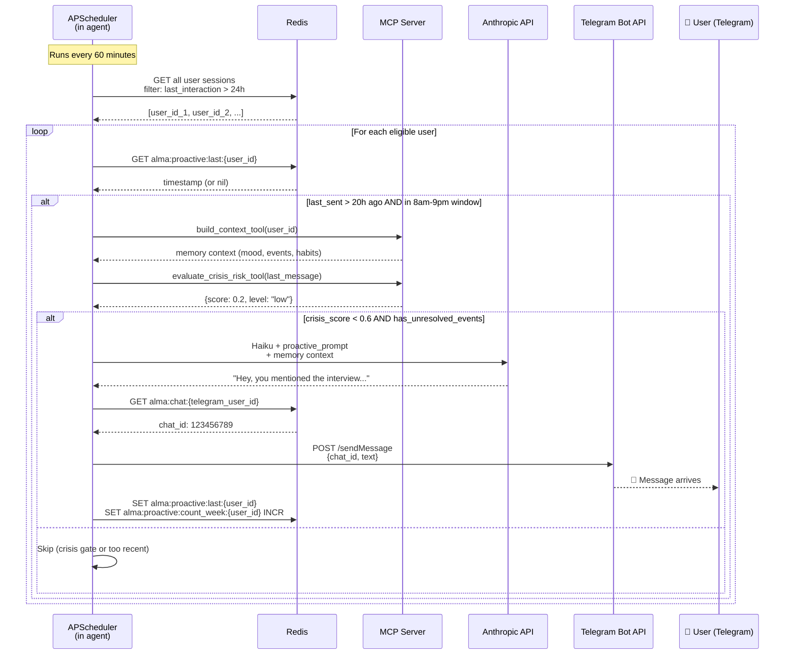

# Proactivity Flow (End-to-End)

This sequence diagram shows how Alma proactively reaches out to users -- a key differentiator designed through the 12-agent debate. APScheduler runs every 60 minutes inside the agent, queries Redis for users who have been inactive for over 24 hours, then evaluates each candidate against 4 safety gates (cooldown, time window, crisis score, unresolved events). Users who pass all gates receive a personalized message generated by Haiku with their memory context, delivered via the Telegram Bot API.

## Proactivity Design Constraints

Consensus from all 12 agents including both stakeholders and clinical advisor:

| Constraint | Value | Source |
|-----------|-------|--------|
| Max messages proactive/week | 3 | UI/UX, Maria, Arthur |
| Send window | 8:00-21:00 local | Maria, Psiquiatria |
| Min cooldown between proactive | 20h | Senior MLE |
| Crisis gate threshold | crisis_score > 0.6 -> skip | Junior MLE, Psiquiatria |
| Silence handling | 2 no-responses -> halve frequency | Senior MLE, Emotional Companion |
| Tone | Short, one open question, no assumptions | UI/UX, Psiquiatria |
| Channel | Telegram only (push) | ALL agents + both stakeholders |
| Consent | Opt-in at onboarding, opt-out with /pausar | Psiquiatria, Emotional Companion |
| Event follow-up timing | Next morning (not immediate) | UI/UX |
| Content trigger | Unresolved events in MCP memory | Senior MLE |

## Key Takeaways

- **4 safety gates in sequence**: A proactive message is only sent if the user has been inactive >24h, the last proactive was >20h ago, the current time is within the 8am-9pm window, and the crisis score is below 0.6.
- **Personalized via memory context**: Each proactive message is generated by Haiku using the user's full memory context (mood history, unresolved events, habits), making it contextually relevant rather than generic.
- **Telegram-only push channel**: The 12-agent debate unanimously decided that proactive outreach only goes through Telegram (push notifications), never through the web interface (pull-only).
