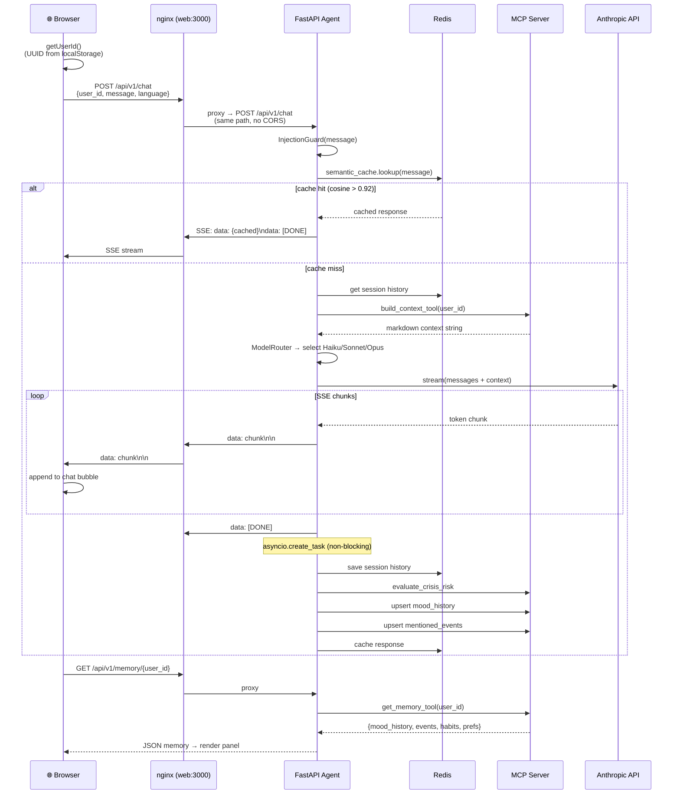

# Web Chat Request Flow (Reactive)

This sequence diagram traces a complete web chat interaction from browser to Alma and back. The browser generates a UUID for user identity (stored in localStorage), sends the message through nginx (same-origin proxy, no CORS), and receives the response as an SSE stream. The diagram covers both cache hit and cache miss paths, the full LLM streaming loop with chunk-by-chunk delivery, and the async post-response work (crisis evaluation, memory upserts, cache storage). It also shows the memory panel fetch that populates the UI sidebar.

## Key Takeaways

- **Two-stage cache with high threshold**: The semantic cache uses a 0.92 cosine similarity threshold, meaning only near-identical questions get cached responses -- avoiding stale or mismatched answers for nuanced emotional conversations.
- **True SSE streaming end-to-end**: Tokens flow chunk-by-chunk from the Anthropic API through the agent and nginx to the browser, giving users real-time typing feedback without waiting for the full response.
- **Post-response work is fully async**: After the `[DONE]` signal, 5 background tasks (session save, crisis evaluation, mood upsert, event extraction, cache storage) run via `asyncio.create_task` without blocking the user experience.
