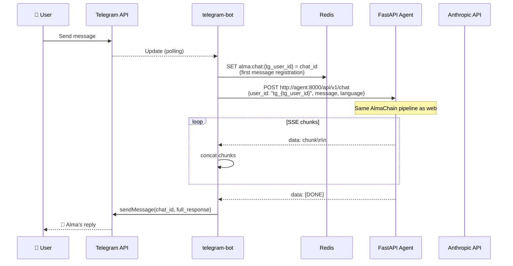

# Telegram Reactive Flow

This sequence diagram shows how a user message flows through the Telegram channel. The telegram-bot service runs a polling loop that receives updates from the Telegram API, registers the user's chat_id in Redis (for proactive messaging later), forwards the message to the FastAPI agent via HTTP, collects the SSE stream chunks, concatenates them into a complete response, and sends it back to the user via the Telegram Bot API. The agent runs the same AlmaChain pipeline as the web flow.

## Key Takeaways

- **Unified pipeline**: The telegram-bot is a thin client -- it forwards messages to the same `/api/v1/chat` endpoint used by the web frontend, ensuring identical behavior across channels.
- **Chat ID registration enables proactivity**: On the first message, the bot stores `alma:chat:{tg_user_id} = chat_id` in Redis, which APScheduler later reads to send proactive messages directly via the Telegram Bot API.
- **SSE concatenation, not streaming**: Unlike the web flow (which streams tokens to the browser in real-time), the Telegram bot collects all SSE chunks and sends the complete response as a single Telegram message.
