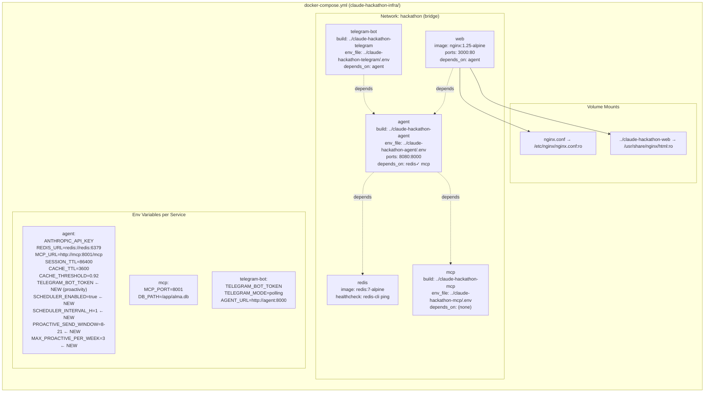

# Docker Network & Volume Map

This diagram shows the complete Docker Compose topology defined in `claude-hackathon-infra/`. It maps all 5 containers with their images, port mappings, environment variables, volume mounts, and dependency chains. The `hackathon` bridge network connects all services internally, while nginx volume mounts serve the static web frontend and its configuration file. Environment variables are loaded from per-service `.env` files in each repository directory.

## Key Takeaways

- **Ordered startup via depends_on**: Redis and MCP start first (no dependencies), then agent (depends on both), then telegram-bot and web (depend on agent), ensuring services are available before their consumers start.
- **Read-only volume mounts**: Both nginx mounts (config file and web assets) are `:ro`, preventing the container from modifying host files -- a security best practice.
- **Proactivity env vars in agent**: The agent service received 5 new environment variables for the proactivity feature (TELEGRAM_BOT_TOKEN, SCHEDULER_ENABLED, SCHEDULER_INTERVAL_H, PROACTIVE_SEND_WINDOW, MAX_PROACTIVE_PER_WEEK).
