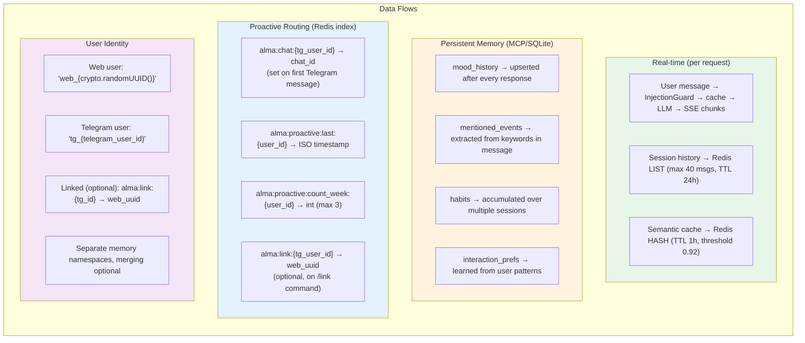

# Complete Data Flow (All Paths)

This diagram categorizes every data type in the Alma system and where it lives. It is organized into four groups: real-time data (per-request message flow, session history in Redis, semantic cache), persistent memory (4 MCP/SQLite layers updated after every response), proactive routing data (Redis keys for chat IDs, send timestamps, weekly counters, and account linking), and user identity (web UUID vs Telegram ID namespacing with optional linking).

## Key Takeaways

- **Ephemeral vs persistent split**: Real-time data (sessions, cache) lives in Redis with TTLs (24h and 1h respectively), while long-term memory lives in SQLite via the MCP server with no expiration.
- **Identity namespacing prevents collisions**: Web users get `web_` prefixed UUIDs and Telegram users get `tg_` prefixed IDs, keeping memory namespaces separate by default with optional linking via `/link`.
- **Proactive routing uses 3 Redis keys per user**: chat_id (for delivery), last_sent timestamp (for cooldown), and weekly counter (for rate limiting) -- all managed atomically by APScheduler.
