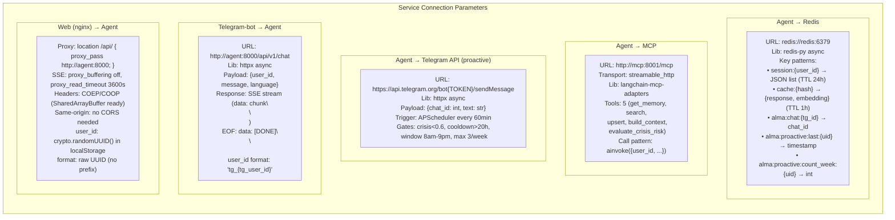

# Inter-Connection Parameters Summary

This diagram is a complete reference for all service connection parameters in the Alma stack. It documents the exact URLs, libraries, key patterns, payload formats, transport protocols, and trigger conditions for every connection: Agent to Redis, Agent to MCP, Agent to Telegram API (proactive), Telegram-bot to Agent (reactive), and Web/nginx to Agent (proxy). Use this as a lookup table when configuring, debugging, or extending service connections.

## Key Takeaways

- **5 Redis key patterns**: The agent uses Redis for 5 distinct purposes (sessions, cache, chat IDs, proactive timestamps, weekly counters), each with its own key pattern and TTL policy.
- **Async everywhere**: Every outbound connection from the agent uses async libraries (redis-py async, langchain-mcp-adapters with ainvoke, httpx async), ensuring the event loop is never blocked during I/O.
- **SharedArrayBuffer-ready headers**: nginx sends COEP/COOP headers so the web frontend can use SharedArrayBuffer if needed for future WebGPU or audio processing features.
